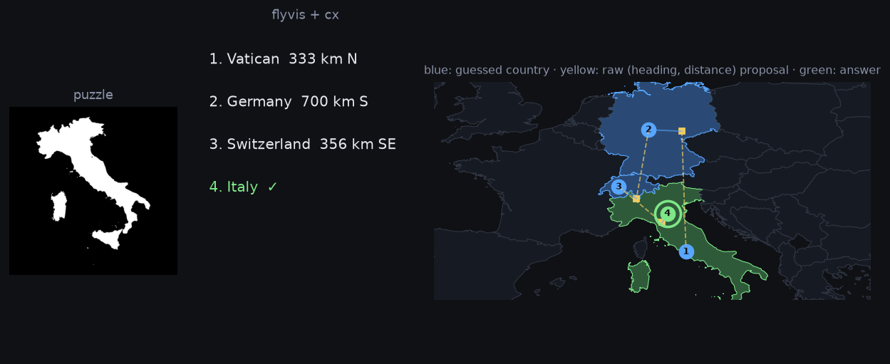
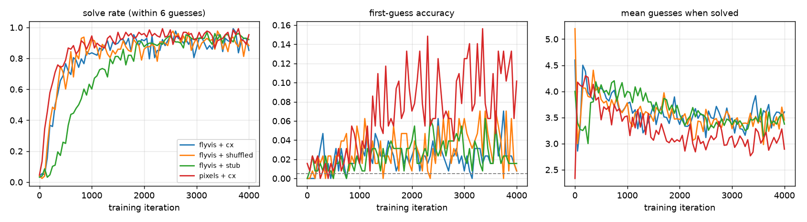

# Fly-brain Worldle

Can a fruit fly's brain learn to play [Worldle](https://worldle.teuteuf.fr/)?

This project wires two pieces of real *Drosophila* connectome data into a reinforcement-learning agent and trains it
to guess a country from its silhouette, then home in using the game's direction + distance feedback:

- **Vision:** [flyvis](https://github.com/TuragaLab/flyvis), a pretrained, connectome-constrained model of the fly
  optic lobe (65 cell types, 45,669 cells, R1–R8 → lamina → medulla → T4/T5). It is frozen and used as the agent's eyes.
- **Decision:** a recurrent network whose wiring is the **central complex** of the
  [MaleCNS connectome](https://male-cns.janelia.org/) (Janelia FlyEM, v1.0), aggregated to cell types. The central
  complex is the fly's real heading-integration circuit, which is the biological job this game demands: combine
  "the answer is 3,000 km north-west of your last guess" across several guesses.

Only synaptic gains on *existing* connections, per-type biases and time constants are trained; the graph and the
excitatory/inhibitory signs (from predicted neurotransmitters) are fixed by the connectome.



## How it works

```
country silhouette
      │  rendered as a short drifting movie (the fly visual system is motion-driven)
      ▼
flyvis optic lobe  (frozen)             ──►  T4/T5 responses, retinotopic, 5,768 features
      │
      ▼
central-complex RNN  ◄──  last guess's feedback: compass direction (8-way, as in Worldle), distance, location
      │  topology + signs from MaleCNS; gains trained
      ▼
policy head  ──►  (heading, distance) from the previous guess, Gaussian
      │
      ▼
destination point on the globe  ──►  nearest country  ──►  guess
```

The game is re-implemented locally ([`flybrain_worldle/game`](flybrain_worldle/game)) from public-domain
[Natural Earth](https://www.naturalearthdata.com/) boundaries, so the agent can play unlimited episodes with any of
168 countries as the answer. Feedback follows Worldle: great-circle distance in km, one of eight compass directions,
and a proximity percentage. Training is REINFORCE with a moving baseline
([`training/reinforce.py`](flybrain_worldle/training/reinforce.py)).

## Results

Greedy policy, every one of the 168 countries as the answer once, 4,000 REINFORCE iterations × 128 episodes, one seed:

| vision | central-complex graph | solved ≤ 6 | mean guesses | 1st-guess accuracy |
|---|---|---|---|---|
| **flyvis (fly optic lobe)** | **MaleCNS wiring** | **96%** | **3.06** | **6%** |
| flyvis | MaleCNS, shuffled | 92% | 3.18 | 5% |
| flyvis | random sparse stub (32 types) | 97% | 2.93 | 5% |
| raw 16×16 pixels | MaleCNS wiring | 97% | 2.66 | 16% |

Chance first-guess accuracy is 0.6%.



What this says, honestly:

- **The feedback loop is the solved part.** Every variant learns to use "3,000 km north-west" across guesses and finds
  the country in ~3 tries, about what a decent human does. That is the central-complex RNN doing heading integration,
  and it works on the real wiring, on shuffled wiring, and on a random graph.
- **The real wiring did not beat the controls on one seed.** 96% vs 92% (shuffled) vs 97% (random stub) is within
  seed-to-seed noise; more seeds would be needed to claim anything, and I don't.
- **Frozen fly vision is a weak silhouette recognizer.** First-guess accuracy is 10× chance but far below the pixel
  control (6% vs 16%). The optic lobe was trained to compute optic flow, not to tell Chile from Norway, and it was not
  fine-tuned here. Recognizing shapes is not what T4/T5 cells are for; the honest result is that the fly's eyes are
  the bottleneck, not its compass.
- Training needed a floor on the Gaussian policy's std: with the 598-type graph, plain REINFORCE reached ~80% and then
  collapsed to ~10% mid-run. The 32-type stub never showed this, which is a good reminder to run the controls early.

Trained checkpoints and logs for the four runs above are in [`runs/`](runs/), and the flyvis features for every
country are cached in `data/cache/`, so the demo and evaluation work from a clone without the pretrained
optic-lobe download.

Controls: `--vision pixels` replaces the fly optic lobe with a raw 16×16 downsample; `--graph shuffled` keeps the
central-complex edge weights but rewires them at random; `--graph stub` is a random sparse graph.

## Run it

```bash
conda create -n flybrain python=3.11 && conda activate flybrain
pip install -e .[dev]
flyvis download-pretrained          # pretrained optic-lobe ensemble (~once)
pytest                              # 25 tests, no network needed

# 1. central-complex connectivity from neuPrint (free account: https://neuprint.janelia.org/account)
export NEUPRINT_TOKEN=...
python scripts/fetch_connectome.py  # -> data/cx_types.csv, data/cx_edges.csv

# 2. train (first run renders every country through flyvis once, ~10 min on CPU, then cached)
python scripts/train.py --vision flyvis --graph cx
python scripts/train.py --vision pixels --graph cx        # control: no fly vision
python scripts/train.py --vision flyvis --graph shuffled  # control: no fly wiring

# 3. evaluate and plot
python scripts/evaluate.py runs/*/best.pt
python scripts/plot_runs.py runs/flyvis_cx_s0 runs/pixels_cx_s0 runs/flyvis_shuffled_s0

# 4. (optional, needs NEUPRINT_TOKEN) brain geometry for the 3D view: neuropil meshes + one skeleton per cell type
python scripts/fetch_brain_geometry.py   # -> data/brain/brain.json.gz (committed, so a clone already has it)

# 5. watch it play
python scripts/run_demo.py --checkpoint runs/flyvis_cx_s0/best.pt   # http://127.0.0.1:8000
```

The demo shows the silhouette, the guesses with Worldle's feedback (the km shown is the distance from *that guess*
to the hidden answer), a map that zooms to the area in play (the yellow squares are the raw (heading, distance)
proposals before snapping to the nearest country), and a 3D central complex: one representative neuron per cell
type from MaleCNS, drawn inside the EB/PB/FB/NO neuropil meshes and coloured by the RNN's activity at each guess.
The 3D view is plain Three.js on the exported geometry; for real analysis use
[navis](https://navis-org.github.io/navis/) (Python, talks to neuPrint directly) or
[neuroglancer](https://github.com/google/neuroglancer), which is what neuPrint and FlyWire use.

## Honest scope

- flyvis's connectome is the FIB-25/FIB-19 optic-lobe reconstruction, not MaleCNS. Only the central-complex RNN is
  built from MaleCNS data. Both are real fly connectomes; the README does not claim more than that.
- The central complex is used at **cell-type** resolution (a few hundred types), not single neurons, and its
  inputs/outputs are trainable linear projections rather than the real sensory pathways into the CX.
- Neuron dynamics are a leaky rate model, not spiking or biophysical.
- The visual features are frozen, so the "fly vision" contribution is exactly what the pretrained optic lobe already
  computes; nothing in the optic lobe is tuned for this task.

## Layout

```
flybrain_worldle/
  game/         countries, silhouettes, great-circle geometry, WorldleEnv
  connectome/   central_complex.py (neuPrint fetch + RNN), vision.py (flyvis wrapper), agent.py, anatomy.py (meshes + skeletons)
  training/     REINFORCE loop, batched torch environment, config
  demo/         FastAPI backend + single-file frontend
scripts/        fetch_connectome, fetch_brain_geometry, train, evaluate, plot_runs, run_demo
tests/          geometry, environment, agent/graph shape tests
```

## Data and citations

- MaleCNS v1.0 connectome, Janelia FlyEM, CC-BY: https://male-cns.janelia.org/
- Lappalainen et al., "Connectome-constrained networks predict neural activity across the fly visual system",
  *Nature* (2024). https://doi.org/10.1038/s41586-024-07939-3 — flyvis, MIT license.
- Nern et al., "Connectome-driven neural inventory of a complete visual system", *Nature* (2025).
- Natural Earth 1:110m cultural vectors, public domain.
- Worldle by teuteuf; this repository re-implements the rules and does not touch the site.

## Acknowledgments

Built with the assistance of [Claude Code](https://claude.com/claude-code).
